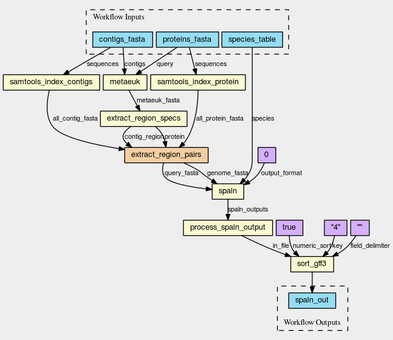

### A CWL workflow for protein evidence mapping

The workflow in [protein_evidence_mapping.cwl](protein_evidence_mapping.cwl) uses [metaeuk](https://github.com/soedinglab/metaeuk) to find regions of overlap between proteins and a genomic contig, then uses `samtools faidx` to extract those regions and [spaln](https://github.com/ogotoh/spaln) to refine the alignment between the proteins and the genome.

An example workflow input file in in [inputs/workflow1_inputs.yml](inputs/workflow1_inputs.yml) and maps some C. semilaevis proteins from RefSeq against a contig from Lates calcarifer (the Asian seabass). With the correct data in place that can be run e.g. as:

`cwltool --parallel protein_evidence_mapping.cwl inputs/workflow1_inputs.yml`

This finds 88 mappings between the 39070 RefSeq proteins and the approximately 2.5 MB contig and runs the region extraction and spaln steps using the (experimental) parallel job support of cwltool.

The diagram below shows the workflow logic (drawn using [cwlviewer](https://view.commonwl.org/)).

